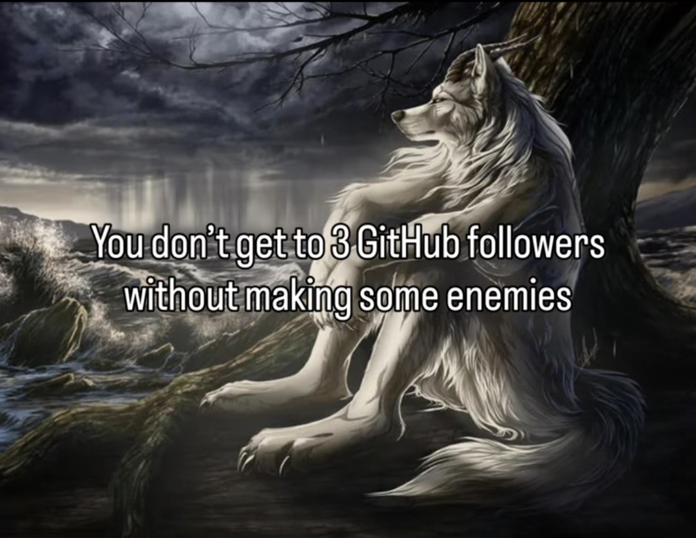

 

Hi! I'm LiukRast and I make minecraft mods/texture packs!

### Languages!
I currently speak **Italian** and **English**;
I can code in **Java**, **Python**, **C++**, **C**, **GLSL**, **PHP**, **JS**

## About Mods
All the public mods I make are always published on
- [CurseForge](https://www.curseforge.com/members/liukrast/projects)
- [Modrinth](https://modrinth.com/user/LIUKRAST)
- A unique GitHub repository, which can be accessed from my repo list or from the two websites above under the "Source" section
- On my personal maven repo [Maven](https://maven.liukrast.net/)
### About Texture Packs
See [Textures Doc](about/textures/README.md)
### About Skins
See [Skins Doc](about/skins/README.md)
